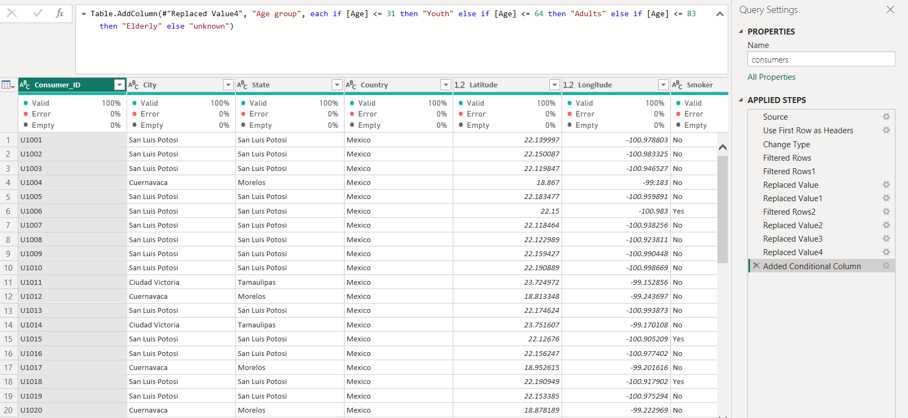
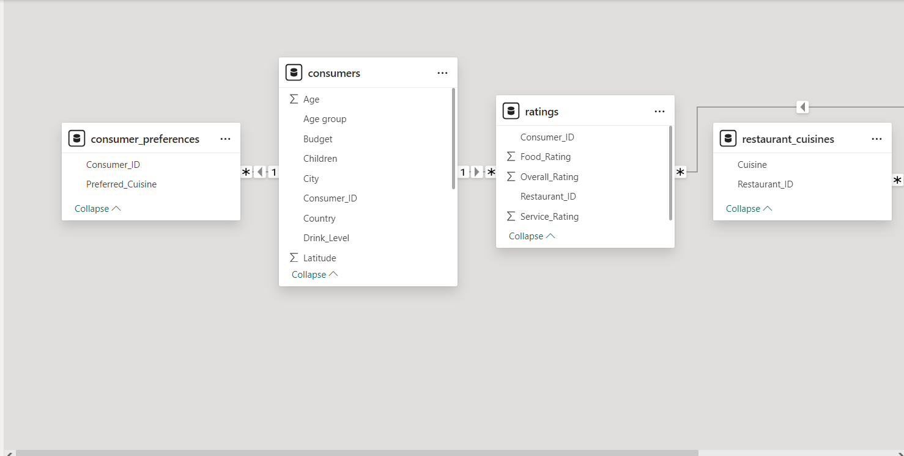
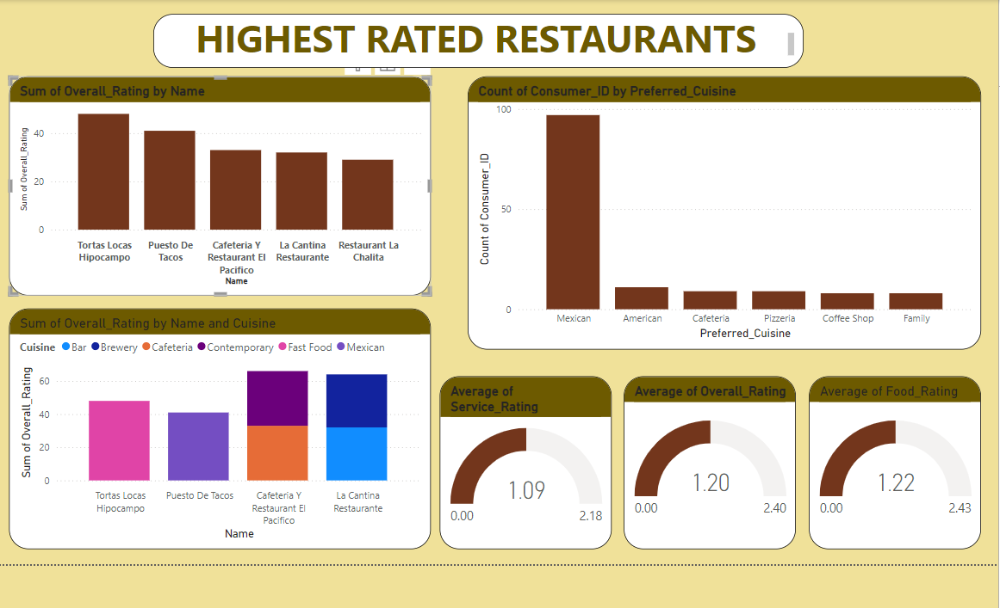
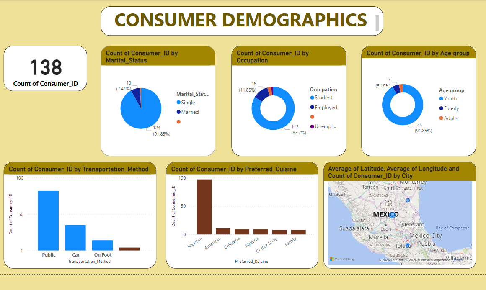

## Restaurant-Rating

# Introduction
This is a power BI project on restaurant rating analysis called restaurant rating dataset. the dataset contains information about restaurants in
Mexico. A customer survey was carried out in this city in 2012 to collate information about each restaurant, their cuisines, information about their consumers and the preferences of the consumers. The project is to analyze and derive meaningful insight from this dataset to aid business entrepreneurs and investors in making more informed decisions.

# Problem statement
1.	What can you learn from the highest rated restaurants? Do consumer preferences have an effect on ratings?
2.	What are the consumer demographics? Does this indicate a bias in the data sample?
3.	Are there any demand & supply gaps that you can exploit in the market?
4.	If you were to invest in a restaurant, which characteristics would you be looking for?

# Skills Demonstrated
-	Data transformation
-	Data cleaning
-	Data sorting
-	New measures
-	Filters
-	Page navigation

# Data sourcing 
I didn't acquire the data until after formulating the queries listed above. I then extracted the CSV file from (https://drive.google.com/file/d/1c1HKM8UTqwWOgexRLOtEJuxjBiA2N6xf/view?usp=drive_link) into Power BI for cleaning, analyzing, and visualizing. 
Its contains 5 tables; 
-	Consumer preferences (33 rows, 2 columns)
-	Consumers (135 rows,15 columns)
-	Rating (999+ rows, 5 columns)
-	Restaurant cuisines ( 112 rows, 2 columns)
-	Restaurants (130 rows, 14 columns)
  
# Data transformation
Data cleaning and transformation was carried out using power query. After scrutinizing all the columns, they were found to be valid and devu=iod of empty cells and errors. However, it was highly important to replace value for empty cells.
Data was efficiently cleaned and transformed with power query editor of Power BI ( image) some of the applied steps included
-	Making first rows as headers in the dataset
-	Format data cells by filling empty cells, replacing null cells with values
-	Datatype then change from “DECIMAL” TO “WHOLE NUMBER”
-	Added a conditional column
-	Close and apply

# Modelling

Automatically derived relationships are adjusted to remove and replace unwanted relationships with the required.

The model is a star schema.
There are 5-dimension tables and 1 fact table. The dimension tables are all joined to the fact table with one-many relationship

Analysis & Visualizations
The report comprises of 2 pages;
-	Highest rated restaurants
-	Consumer demography
You can interact with the report here (link to powerbi)

1. Highest rated restaurants
   
     

From the dashboard, it can observe that Mexicans are the highest rated restaurants.

2.	Consumer demography
	
     
  	
From the dashboard, it can be observed that youths are the highest age group that patronize the restaurant, who are also single and students. Public transportation is the most used transport system.

# Conclusion and recommendation
When rating restaurants, demographics and customer preferences are very important factors therefore insights from this dataset is helpful to make decisions. from the dataset we could see that that the market has observable gaps in supply and demand that can be taken advantage of. As an investor, the characteristics I would be looking are school districts areas with youth as the highest population. I would also focus on Mexican foods and exploit more international cuisine. I will enhance the social media presence to get new clients and provide different types of delivery services and expand parking space to encourage more clients.

